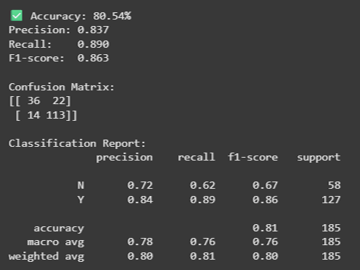
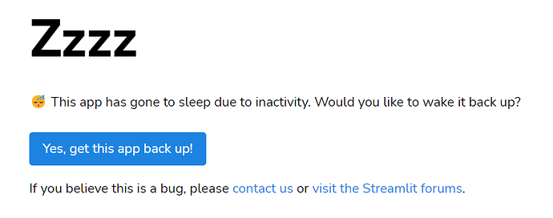
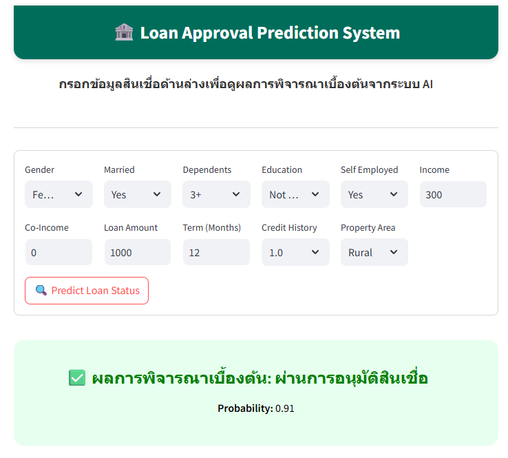
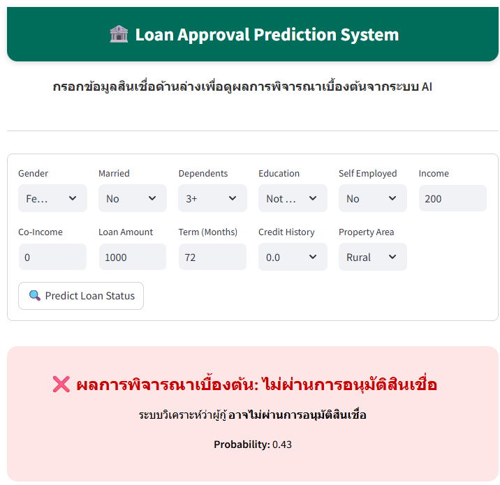

# Loan Approval Prediction System 🏦

A machine learning-based system designed to assist financial institutions in streamlining loan approval processes. This project utilizes an Artificial Neural Network (ANN) to improve decision-making accuracy and reduce processing time. 

## 📝 About the Project
This project was developed for the course **240-318 Artificial Intelligence and Machine Learning**, Semester 1, Academic Year 2025, Faculty of Engineering, Prince of Songkla University. The goal is to address challenges in traditional loan processing, such as delays and inconsistency in manual decision-making. 

## 🛠 Tech Stack
* **Language:** Python
* **Machine Learning:** TensorFlow, Keras, Scikit-learn, Pandas, NumPy
* **Web Framework:** Streamlit 
* **Deployment:** Streamlit Cloud 

## 🧠 AI Model Architecture
We implemented an **Artificial Neural Network (ANN)**, which excels at capturing complex, multi-dimensional relationships between variables compared to traditional statistical analysis. 
* **Input Layer:** 11 Features 
* **Hidden Layers:** 2 Layers (32 & 16 Neurons) with ReLU Activation 
* **Output Layer:** Sigmoid Activation (for Binary Classification) 
* **Optimizer:** Adam 

## 📊 Model Performance 
Evaluated using the Home Loan Approval Dataset from Kaggle: 
* **Accuracy:** 80.54% 
* **F1-Score:** 0.863 
* **Recall:** 0.890 

## 🚀 How to use
You can access the live Web Application here: https://loan-approval-ai-7fvffztvnizjnzqf8fsehj.streamlit.app

> **Note regarding access:** Since this app uses Streamlit Cloud's free hosting tier, it may go to **Sleep** after a period of inactivity to save resources.
> 
> If you encounter a **"Zzzz"** screen (as shown below), simply click the **"Yes, get this app back up!"** button to wake the application.

## 🔍 Example Usage
Here are examples of the model's decision-making process based on sample inputs:

### Case 1: Approved Loan
* **Input Data**:
    * **Gender**: Female, **Married**: Yes, **Dependents**: 3+, **Education**: Not Graduate, **Self Employed**: Yes
    * **Applicant Income**: 300, **Coapplicant Income**: 0
    * **Loan Amount**: 1,000, **Term**: 12 months, **Credit History**: 1.0, **Area**: Rural
* **Result**: ✅ **Approved** (Probability: 0.91)

### Case 2: Rejected Loan
* **Input Data**:
    * **Gender**: Female, **Married**: No, **Dependents**: 3+, **Education**: Not Graduate, **Self Employed**: No
    * **Applicant Income**: 200, **Coapplicant Income**: 0
    * **Loan Amount**: 1,000, **Term**: 72 months, **Credit History**: 0.0, **Area**: Rural
* **Result**: ❌ **Rejected** (Probability: 0.43)

